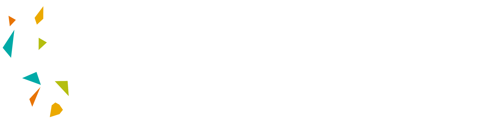
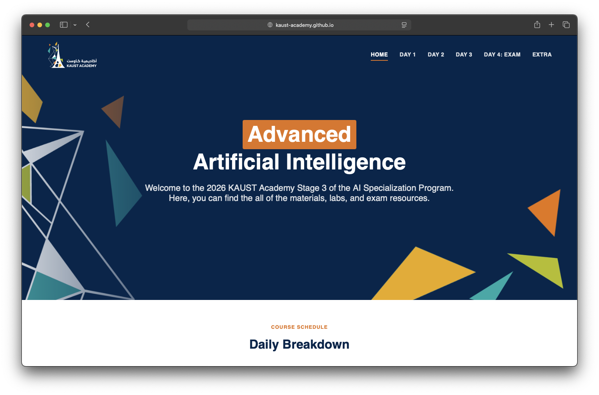

# KAUST Academy 2026 - Computer Vision (YASREF)



Welcome to the **KAUST Academy 2026 YASREF Computer Vision Program**. This repository contains all materials and labs for the Computer Vision course — covering everything from CNN fundamentals to Vision Transformers.

## Course Materials

Access the course content through the website:

<p align="center">
  <a href="https://kaust-academy.github.io/2026_YASERF_computer_vision/">
    
  </a>
</p>

<h3 align="center">
  <a href="https://kaust-academy.github.io/2026_YASERF_computer_vision/">
    🔗 Access Content Website
  </a>
</h3>

---

## Repository Structure

```
├── Slides/
│   ├── Day 1/   # CNN slides
│   ├── Day 2/   # Augmentation & Transfer Learning slides
│   ├── Day 3/   # Segmentation slides
│   ├── Day 4/   # Object Detection slides
│   └── Day 5/   # Vision Transformers slides
├── Labs/
│   ├── Day 1/   # PyTorch Basics, CNNs
│   ├── Day 2/   # Datasets, Transfer Learning
│   ├── Day 3/   # Segmentation notebooks
│   ├── Day 4/   # Object Detection notebooks
│   └── Day 5/   # Vision Transformer notebooks
└── Summaries/   # Day-by-day concept summaries
```

## License

Licensed under [GPL-3.0](https://github.com/KAUST-Academy/2026_YASERF_computer_vision?tab=GPL-3.0-1-ov-file#readme).

> ⚠️ **Important:** Recording and uploading lectures online is not permitted.
